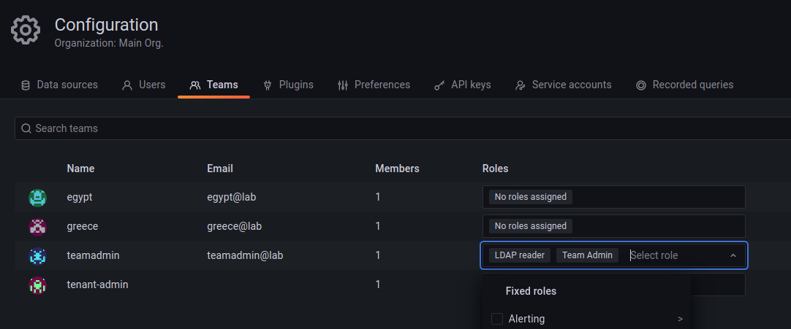

# Testing team and rbac assignements through Grafana API

- [Testing team and rbac assignements through Grafana API](#testing-team-and-rbac-assignements-through-grafana-api)
  - [Get all teams](#get-all-teams)
  - [Check if access control is enabled](#check-if-access-control-is-enabled)
  - [Get all roles available](#get-all-roles-available)
  - [Assign roles in bulk](#assign-roles-in-bulk)

## Get all teams

```sh
curl -s -u admin:password https://grafana-enterprise.work.lan/api/teams/search | jq
```

example output

```json
{
  "totalCount": 4,
  "teams": [
    {
      "id": 1,
      "orgId": 1,
      "name": "egypt",
      "email": "egypt@lab",
      "avatarUrl": "/avatar/84213fcc096692d39f83dd4ae4d81a79",
      "memberCount": 1,
      "permission": 0,
      "accessControl": null
    },
    {
      "id": 2,
      "orgId": 1,
      "name": "greece",
      "email": "greece@lab",
      "avatarUrl": "/avatar/c190fae8e745a4c264de5b150ea7c728",
      "memberCount": 1,
      "permission": 0,
      "accessControl": null
    },
    {
      "id": 3,
      "orgId": 1,
      "name": "teamadmin",
      "email": "teamadmin@lab",
      "avatarUrl": "/avatar/484a30676dfd183606598488cf9d5b6a",
      "memberCount": 1,
      "permission": 0,
      "accessControl": null
    },
    {
      "id": 4,
      "orgId": 1,
      "name": "tenant-admin",
      "email": "",
      "avatarUrl": "/avatar/00f39ffa6e12edecebec64cef9ca4fae",
      "memberCount": 1,
      "permission": 0,
      "accessControl": null
    }
  ],
  "page": 1,
  "perPage": 1000
}

```

## Check if access control is enabled

```sh
curl -s -u admin:password https://grafana-enterprise.work.lan/api/access-control/status | jq
```

example output

```json
{
  "enabled": true
}
```


## Get all roles available

```
curl -s -u admin:password https://grafana-enterprise.work.lan/api/access-control/roles | jq
```

example output

```json
[
  {
    "version": 1,
    "uid": "laZ6gXi4z",
    "name": "fixed:ldap:reader",
    "displayName": "LDAP reader",
    "description": "Read LDAP configuration and status.",
    "group": "LDAP",
    "updated": "2022-09-29T07:20:45Z",
    "created": "2022-08-18T10:41:43Z",
    "global": true
  },
  {
    "..."
  },
  {
    "version": 0,
    "uid": "teamadmin",
    "name": "Team Admin",
    "displayName": "Team Admin",
    "description": "Create data sources for the team",
    "group": "",
    "updated": "2022-08-18T10:41:43Z",
    "created": "2022-08-18T10:41:43Z",
    "global": false
  }
]

```

## Assign roles in bulk

```sh
curl -s -u admin:password --request PUT 'https://grafana-enterprise.work.lan/api/access-control/teams/3/roles' \
--header 'Content-Type: application/json' \
--data-raw '{
    "roleUids": [
        "laZ6gXi4z",
        "teamadmin"
    ]
}'

```

output example

```json
{"message":"Team roles have been updated."}
```

